# SP.RBAC.API - Rollebasert tilgangskontroll API

[](https://dotnet.microsoft.com/)
[](LICENSE)

En omfattende .NET 9 Web API for håndtering av rollebasert tilgangskontroll med støtte for integrasjonssystemer, entitetsdefinisjoner, egenskapsdefinisjoner og entitetsinstanser.

> **Merk**: Dette er et Proof of Concept (PoC) repository som demonstrerer moderne .NET-arkitektur og beste praksis for rollebasert tilgangskontroll.

## Funksjonalitet

- **Integrasjonssystemhåndtering**: CRUD-operasjoner for eksterne systemer (HR, EMR, CRM, etc.)
- **Entitetsdefinisjoner**: Definer datastrukturer for entiteter som brukere, roller, avdelinger
- **Egenskapsdefinisjoner**: Definer egenskaper/attributter for entiteter med ulike datatyper  
- **Entitetsinstanser**: Håndter faktiske entitetsposter med egenskapsverdier (EAV-mønster)
- **Tilgangsregler**: Forretningsregler for automatisk tilgangstildeling
- **Tilgangstildelinger**: Bruker-rolle-system kartlegging
- **Egenskapsverdier**: Verdier for entitetsegenskaper med historikk
- **Synkroniseringslogger**: Sporing av synkroniseringsaktiviteter
- **Pagineringssstøtte**: Alle liste-endepunkter støtter paginering
- **In-Memory Database**: Bruker Entity Framework Core med In-Memory database for enkel testing
- **AutoMapper-integrasjon**: Automatisk kartlegging mellom entiteter og DTOer
- **Swagger-dokumentasjon**: Interaktiv API-dokumentasjon på rot-URL
- **Eksempeldata**: Forhåndsinitialisert med eksempel integrasjonssystemer og entitetsdata

## Teknologistakk

- **.NET 9**: Nyeste .NET-rammeverk
- **ASP.NET Core Web API**: RESTful API-rammeverk
- **Entity Framework Core**: ORM med In-Memory og SQL Server-støtte
- **AutoMapper**: Objekt-til-objekt kartlegging
- **Swagger/OpenAPI**: API-dokumentasjon
- **CORS**: Cross-origin resource sharing aktivert

## Arkitektur og utviklingsprinsipper

Dette prosjektet følger etablerte arkitekturprinsipper og beste praksis:

### Clean Architecture

- **Domain Layer**: Kjerneforretningslogikk og entiteter
- **Application Layer**: Brukstilfeller og applikasjonslogikk
- **Infrastructure Layer**: Database, eksterne tjenester og implementasjoner
- **API Layer**: HTTP-endepunkter og presentasjonslogikk

### Domain-Driven Design (DDD)

- **Aggregates**: Forretningsobjekter med identitet og konsistens
- **Value Objects**: Uforanderlige objekter definert av attributter
- **Domain Events**: Hendelser som signaliserer endringer i domenet
- **Repositories**: Grensesnitt for datalagertilgang
- **Strongly Typed IDs**: Type-sikre identifikatorer

### Utviklingspraksis

- **Test-Driven Development (TDD)**: Test først, deretter implementering
- **Conventional Commits**: Strukturerte commit-meldinger
- **Object Calisthenics**: Prinsipper for ren kode
- **Automatisk testing**: Unit tests og integrasjonstester

## Repositorystruktur

```text
sp-rbac-poc/
├── .github/                       # GitHub-konfigurasjon og instruksjoner
│   ├── chatmodes/                # GitHub Copilot chatmodes
│   │   └── architect.chatmode.md
│   ├── instructions/             # Utviklingsinstruksjoner og regler
│   │   ├── clean-architecture.instructions.md
│   │   ├── coding-style-csharp.instructions.md
│   │   ├── conventional-commits.instructions.md
│   │   ├── domain-driven-design.instructions.md
│   │   ├── follow-up-question.instructions.md
│   │   ├── object-calisthenics.instructions.md
│   │   └── unit-and-integration-tests.instructions.md
│   └── copilot-instructions.md   # Hovedinstruksjoner for GitHub Copilot
├── .vscode/                      # VS Code-konfigurasjon
│   ├── settings.json            # VS Code-innstillinger
│   └── mcp.json                 # Model Context Protocol-konfigurasjon
├── sp.rbac.api/                 # Hovedprosjekt (API)
│   ├── Controllers/             # API-kontrollere
│   ├── Data/                    # Datakontekst og kartlegging
│   ├── DTOs/                    # Data Transfer Objects
│   ├── Entities/                # Domeneentiteter
│   └── Program.cs               # Applikasjonskonfigurasjon
├── sp-rbac-poc.sln             # Visual Studio Solution-fil
└── README.md                   # Repositorydokumentasjon
```

## Prosjektstruktur (API)

```text
sp-rbac-poc/
├── sp.rbac.api/                   # Hoved-API-prosjekt
│   ├── Controllers/               # API-kontrollere
│   │   ├── IntegrationSystemsController.cs
│   │   ├── EntityDefinitionsController.cs
│   │   ├── PropertyDefinitionsController.cs
│   │   ├── EntityInstancesController.cs
│   │   ├── PropertyValuesController.cs
│   │   ├── AccessRulesController.cs
│   │   ├── AccessAssignmentsController.cs
│   │   └── SyncLogsController.cs
│   ├── Data/                      # Datakontekst og kartlegging
│   │   ├── RbacDbContext.cs
│   │   └── MappingProfile.cs
│   ├── DTOs/                      # Data Transfer Objects
│   │   ├── CommonDTOs.cs
│   │   ├── IntegrationSystemDTOs.cs
│   │   ├── EntityDefinitionDTOs.cs
│   │   ├── PropertyDefinitionDTOs.cs
│   │   ├── EntityInstanceDTOs.cs
│   │   ├── PropertyValueDTOs.cs
│   │   ├── AccessRuleDTOs.cs
│   │   ├── AccessAssignmentDTOs.cs
│   │   └── SyncLogDTOs.cs
│   ├── Entities/                  # Domeneentiteter
│   │   ├── BaseEntity.cs
│   │   ├── BaseAuditableEntity.cs
│   │   ├── Enums.cs
│   │   ├── IntegrationSystem.cs
│   │   ├── EntityDefinition.cs
│   │   ├── PropertyDefinition.cs
│   │   ├── EntityInstance.cs
│   │   ├── PropertyValue.cs
│   │   ├── AccessRule.cs
│   │   ├── AccessAssignment.cs
│   │   └── SyncLog.cs
│   ├── Properties/
│   │   └── launchSettings.json
│   ├── SP.RBAC.API.csproj
│   └── Program.cs                 # Applikasjonskonfigurasjon og oppstart
├── sp-rbac-poc.sln               # Visual Studio Solution-fil
└── README.md                     # Denne filen
```

## API-endepunkter

### Integrasjonssystemer

- `GET /api/IntegrationSystems` - List integrasjonssystemer med paginering
- `GET /api/IntegrationSystems/{id}` - Hent spesifikt integrasjonssystem
- `POST /api/IntegrationSystems` - Opprett nytt integrasjonssystem
- `PUT /api/IntegrationSystems/{id}` - Oppdater integrasjonssystem
- `DELETE /api/IntegrationSystems/{id}` - Slett integrasjonssystem (soft delete)
- `POST /api/IntegrationSystems/{id}/test-connection` - Test systemtilkobling

### Entitetsdefinisjoner

- `GET /api/EntityDefinitions` - List entitetsdefinisjoner med paginering
- `GET /api/EntityDefinitions/{id}` - Hent spesifikk entitetsdefinisjon
- `POST /api/EntityDefinitions` - Opprett ny entitetsdefinisjon
- `PUT /api/EntityDefinitions/{id}` - Oppdater entitetsdefinisjon
- `DELETE /api/EntityDefinitions/{id}` - Slett entitetsdefinisjon (soft delete)
- `GET /api/EntityDefinitions/{id}/property-definitions` - Hent egenskapsdefinisjoner for entitet

### Egenskapsdefinisjoner

- `GET /api/PropertyDefinitions` - List egenskapsdefinisjoner med paginering
- `GET /api/PropertyDefinitions/{id}` - Hent spesifikk egenskapsdefinisjon
- `POST /api/PropertyDefinitions` - Opprett ny egenskapsdefinisjon
- `PUT /api/PropertyDefinitions/{id}` - Oppdater egenskapsdefinisjon
- `DELETE /api/PropertyDefinitions/{id}` - Slett egenskapsdefinisjon (soft delete)
- `GET /api/PropertyDefinitions/data-types` - Hent tilgjengelige datatyper

### Entitetsinstanser

- `GET /api/EntityInstances` - List entitetsinstanser med paginering
- `GET /api/EntityInstances/{id}` - Hent spesifikk entitetsinstans
- `POST /api/EntityInstances` - Opprett ny entitetsinstans
- `PUT /api/EntityInstances/{id}` - Oppdater entitetsinstans
- `DELETE /api/EntityInstances/{id}` - Slett entitetsinstans (soft delete)

### Egenskapsverdier

- `GET /api/PropertyValues` - List egenskapsverdier med paginering
- `GET /api/PropertyValues/{id}` - Hent spesifikk egenskapsverdi
- `POST /api/PropertyValues` - Opprett ny egenskapsverdi
- `PUT /api/PropertyValues/{id}` - Oppdater egenskapsverdi
- `GET /api/PropertyValues/entity-instance/{entityInstanceId}` - Hent verdier for entitetsinstans
- `GET /api/PropertyValues/property-definition/{propertyDefinitionId}` - Hent verdier for egenskapsdefinisjon
- `GET /api/PropertyValues/entity-instance/{entityInstanceId}/history` - Hent historikk for entitetsinstans

### Tilgangsregler

- `GET /api/AccessRules` - List tilgangsregler med paginering
- `GET /api/AccessRules/{id}` - Hent spesifikk tilgangsregel
- `POST /api/AccessRules` - Opprett ny tilgangsregel
- `PUT /api/AccessRules/{id}` - Oppdater tilgangsregel
- `POST /api/AccessRules/{id}/execute` - Utfør tilgangsregel manuelt
- `GET /api/AccessRules/trigger-types` - Hent tilgjengelige triggertyper
- `GET /api/AccessRules/action-types` - Hent tilgjengelige aksjonstyper

### Tilgangstildelinger

- `GET /api/AccessAssignments` - List tilgangstildelinger med paginering
- `GET /api/AccessAssignments/{id}` - Hent spesifikk tilgangstildeling
- `POST /api/AccessAssignments` - Opprett ny tilgangstildeling
- `PUT /api/AccessAssignments/{id}` - Oppdater tilgangstildeling
- `GET /api/AccessAssignments/user/{userId}` - Hent tildelinger for bruker
- `GET /api/AccessAssignments/system/{targetSystemId}` - Hent tildelinger for system
- `GET /api/AccessAssignments/assignment-types` - Hent tilgjengelige tildelingstyper

### Synkroniseringslogger

- `GET /api/SyncLogs` - List synkroniseringslogger med paginering
- `GET /api/SyncLogs/{id}` - Hent spesifikk synkroniseringslogg
- `POST /api/SyncLogs` - Opprett ny synkroniseringslogg
- `PUT /api/SyncLogs/{id}` - Oppdater synkroniseringslogg
- `GET /api/SyncLogs/integration-system/{integrationSystemId}` - Hent logger for integrasjonssystem
- `GET /api/SyncLogs/sync-statuses` - Hent tilgjengelige synkroniseringsstatuser
- `GET /api/SyncLogs/summary` - Hent sammendrag av synkroniseringsaktivitet
- `GET /api/SyncLogs/failed` - Hent feilede synkroniseringer

## Detaljert datamodell og domeneanalyse

SP.RBAC.API er et sofistikert rollebasert tilgangskontrollsystem som implementerer Entity-Attribute-Value (EAV) mønsteret for å håndtere dynamiske entiteter fra multiple eksterne systemer. Systemet fungerer som en sentral hub for tilgangsstyring på tvers av organisasjonens ulike fagsystemer.

### Kjerneentiteter - Detaljert analyse

#### 1. IntegrationSystem - Integrasjonssystemer

**Formål**: Representerer eksterne fagsystemer som kobles til RBAC-løsningen for sentralisert tilgangsstyring.

**Domeneansvar**:

- Håndterer systemkonfigurasjon og autentiseringsoppsett
- Sporer synkroniseringsstatus og ytelse
- Fungerer som rot for alle entiteter fra det eksterne systemet

**Nøkkelfelter**:

- `Name`: Unikt systemnavn (f.eks. "HR_System", "EMR_Main")
- `SystemType`: Kategorisering (HR, EMR, CRM, Financial, etc.)
- `ConnectionString`: Teknisk tilkoblingsstring for datahenting
- `AuthenticationType`: Støtter Database, LDAP, OAuth2, SAML, JWT, ApiKey
- `Configuration`: JSON-basert fleksibel konfigurasjon
- `LastSync`/`LastSyncStatus`: Overvåking av datasynkronisering

**Relasjoner**:

- En-til-mange: EntityDefinitions, SyncLogs, AccessRules, AccessAssignments

#### 2. EntityDefinition - Entitetsdefinisjoner

**Formål**: Definerer strukturen og metadata for entitetstyper fra eksterne systemer (f.eks. User, Role, Department, Project).

**Domeneansvar**:

- Beskriver entitetstypens struktur og egenskaper
- Kartlegger fra eksterne systemers tabeller/endepunkter
- Støtter dynamisk skjemadefinisjoner

**Nøkkelfelter**:

- `Name`: Entitetstypens navn (f.eks. "User", "Role", "Department")
- `TableName`: Kildetabell eller endepunkt i det eksterne systemet
- `PrimaryKeyField`: Primærnøkkel i kildesystemet
- `Metadata`: JSON for utvidbare metadata og konfigurasjon

**Relasjoner**:

- Tilhører: IntegrationSystem
- En-til-mange: PropertyDefinitions, EntityInstances

#### 3. PropertyDefinition - Egenskapsdefinisjoner

**Formål**: Definerer individuelle attributter/felter for entitetstyper med rik metadata for validering og UI-generering.

**Domeneansvar**:

- Spesifiserer datatyper og valideringsregler
- Støtter dynamisk UI-generering gjennom metadata
- Håndterer søk og visningslogikk

**Nøkkelfelter**:

- `DataType`: Støtter 12 typer inkludert String, Integer, Email, Phone, JSON
- `SourceField`: Kartlegging til feltnavn i kildesystemet
- `ValidationRules`: JSON-baserte valideringsregler
- `UIMetadata`: Konfigurasjon for automatisk UI-generering
- `IsSearchable`/`IsDisplayed`/`IsEditable`: Adferdskontroll

**Relasjoner**:

- Tilhører: EntityDefinition
- En-til-mange: PropertyValues

#### 4. EntityInstance - Entitetsinstanser

**Formål**: Representerer faktiske dataposter fra eksterne systemer (f.eks. en spesifikk bruker, rolle eller avdeling).

**Domeneansvar**:

- Lagrer referanse til original data fra kildesystemet
- Sporer synkroniseringsstatus for hver instans
- Fungerer som kobling mellom eksterne data og RBAC-systemet

**Nøkkelfelter**:

- `ExternalId`: Unikt ID fra kildesystemet
- `RawData`: JSON med originaldata for audit og feilsøking
- `LastSyncedAt`/`SyncStatus`: Instans-spesifikk synkroniseringssporing

**Relasjoner**:

- Tilhører: EntityDefinition
- En-til-mange: PropertyValues
- Kan være User eller Role i AccessAssignments

#### 5. PropertyValue - Egenskapsverdier (EAV-mønster)

**Formål**: Lagrer faktiske verdier for entitetsegenskaper med support for historikk og temporale data.

**Domeneansvar**:

- Implementerer EAV-mønster for fleksibel datalagring
- Støtter tidsbaserte verdier med EffectiveFrom/EffectiveTo
- Separerer lagret verdi fra visningsverdi

**Nøkkelfelter**:

- `Value`: Råverdi som lagret i systemet
- `DisplayValue`: Formatert verdi for visning
- `EffectiveFrom`/`EffectiveTo`: Temporal gyldighet
- `IsDefault`: Markering av standardverdier

**Relasjoner**:

- Tilhører: EntityInstance og PropertyDefinition
- Unikt par per entitetsinstans og egenskapsdefinisjon

#### 6. AccessRule - Tilgangsregler

**Formål**: Implementerer forretningslogikk for automatisk tilgangstildeling basert på entitetsdata og hendelser.

**Domeneansvar**:

- Definerer triggere for automatisk tilgangstildeling
- Implementerer regelbasert tilgangsstyring
- Støtter komplekse forretningsregler via JSON-konfigurasjon

**Nøkkelfelter**:

- `TriggerType`: PropertyChange, NewEntity, EntityUpdate, EntityDelete, Schedule, Manual
- `TriggerCondition`: JSON-uttrykk for triggerbetingelser
- `ActionType`: AssignRole, RemoveRole, UpdateProperty, CreateEntity, DeleteEntity, SendNotification
- `ActionConfiguration`: JSON-konfigurasjon for aksjonsutførelse
- `Priority`: Rekkefølge for regelutførelse

**Relasjoner**:

- Kan tilhøre: IntegrationSystem (globale vs. systemspesifikke regler)
- Mange-til-mange: AccessAssignments

#### 7. AccessAssignment - Tilgangstildelinger

**Formål**: Representerer faktiske tilgangstildelinger mellom brukere, roller og målsystemer.

**Domeneansvar**:

- Kartlegger bruker-rolle-system relasjoner
- Støtter ulike tildelingstyper og tidsbasert gyldighet
- Sporer godkjenning og begrunnelse

**Nøkkelfelter**:

- `UserId`/`RoleId`: Referanser til EntityInstance-objekter
- `AssignmentType`: Direct, Inherited, Automatic, Temporary
- `EffectiveFrom`/`EffectiveTo`: Tidsbasert gyldighet
- `ApprovedBy`/`ApprovedAt`: Godkjenningssporing

**Relasjoner**:

- User og Role: EntityInstance objekter
- TargetSystem: IntegrationSystem
- Mange-til-mange: AccessRules

#### 8. SyncLog - Synkroniseringslogger

**Formål**: Detaljert logging og overvåking av datasynkronisering mellom eksterne systemer og RBAC-løsningen.

**Domeneansvar**:

- Sporer synkroniseringsoperasjoner og ytelse
- Gir detaljert feildiagnostikk
- Støtter operasjonell overvåking og SLA-rapportering

**Nøkkelfelter**:

- `Operation`: Import, Export, Update, Delete
- `Status`: Pending, InProgress, Success, Failed, Cancelled
- `TotalRecords`/`ProcessedRecords`/`SuccessfulRecords`/`FailedRecords`: Detaljert statistikk
- `Details`: JSON med utvidede detaljer og metrikker

**Relasjoner**:

- Tilhører: IntegrationSystem

### Arkitekturmønster og designprinsipper

#### Entity-Attribute-Value (EAV) Pattern

Systemet implementerer EAV-mønsteret gjennom PropertyDefinition/PropertyValue-parene, som muliggjør:

- **Dynamisk skjemadefinisjon**: Nye attributter kan legges til uten databaseendringer
- **Fleksibel datamodellering**: Ulike entitetstyper kan ha helt forskjellige attributter
- **Versjonshåndtering**: Endringer i skjemadefinisjoner påvirker ikke eksisterende data

#### Temporal Data Support

Systemet støtter tidsbaserte data gjennom:

- **PropertyValue.EffectiveFrom/EffectiveTo**: Attributtverdier med gyldighetsperioder
- **AccessAssignment.EffectiveFrom/EffectiveTo**: Tidsbaserte tilgangstildelinger
- **Audit Trail**: Komplett sporing av alle endringer med tidsstempler

#### Soft Delete Pattern

Alle entiteter bruker myk sletting for:

- **Datahistorikk**: Bevarer historisk data for audit og gjenoppretting
- **Referanseintegritet**: Unngår brutte relasjoner ved sletting
- **Compliance**: Oppfyller krav til dataoppbevaring

### Foreslåtte modellforbedringer og utvidelser

Basert på analysen av domenemodellen og arkitekturprinsippene, foreslås følgende forbedringer:

#### 1. Domenemodell-forbedringer

**Sterkt typede ID-klasser (Value Objects)**:
- `IntegrationSystemId`, `EntityDefinitionId`, `PropertyDefinitionId`
- `EntityInstanceId`, `PropertyValueId`, `AccessRuleId`, `AccessAssignmentId`
- Sikrer type-safety og forhindrer ID-blanding på tvers av entiteter

**Nye Value Objects for forretningslogikk**:
- `SystemConfiguration`: Kapsler konfigurasjonshåndtering for IntegrationSystem
- `ValidationRule`: Sterkt typet validering for PropertyDefinition
- `EffectivePeriod`: Temporal gyldighetslogikk for AccessAssignment og PropertyValue
- `SyncMetrics`: Kapsler synkroniseringsstatistikk for SyncLog

**Forbedret entitetshåndtering**:
- Factory methods for alle aggregates (f.eks. `IntegrationSystem.Create()`)
- Private konstruktører for å tvinge factory-bruk
- Fjern public setters og bruk metoder med intensjonsavsløring

#### 2. Nye entiteter for utvidet funksjonalitet

**ApprovalWorkflow** - Godkjenningsarbeidsflyt:
- Håndterer komplekse godkjenningsprosesser for tilgangstildelinger
- Støtter flertrinnsgodkjenning og eskalering
- Sporer godkjenningsstatus og historikk

**AuditEvent** - Detaljert revisjonssporing:
- Utvidet audit-logging utover BaseAuditableEntity
- Støtter forretningshendelser og brukeraksjon-sporing
- Integrerer med AccessRule for automatisk audit-generering

**NotificationTemplate** - Varslingshåndtering:
- Konfigurerbare meldingsmaler for ulike hendelser
- Støtter flerspråklige varsler og forskjellige kanaler
- Integrerer med AccessRule for automatisk varsling

**PolicyDefinition** - Utvidede sikkerhetspolicyer:
- Definerer overordnede sikkerhetspolicyer på tvers av systemer
- Støtter komplekse forretningsregler og compliance-krav
- Kan overstyre eller supplere AccessRule-logikk

#### 3. Arkitekturmessige forbedringer

**Konsistent domenemodellering**:
- Alle aggregates følger DDD-prinsipper med private konstruktører
- Factory methods for kompleks objektopprettelse
- Forretningsmetoder med intensjonsavsløring navn (ikke CRUD)

**Forbedret EAV-implementering**:
- Sterkere typing for PropertyValue basert på DataType
- Validering av verdier mot PropertyDefinition
- Støtte for komplekse datatyper (referanser, relasjoner)

**Event-drevet arkitektur**:
- Domain events for kritiske forretningshendelser
- Integration events for tverrsystem-kommunikasjon
- Event sourcing for kritiske audit-krav

#### 4. Tekniske forbedringer

**Ytelse og skalerbarhet**:
- Indeksering basert på søkemønstre i PropertyValue
- Materialiserte visninger for komplekse spørringer
- Caching-strategi for ofte brukte konfigurasjonser

**Sikkerhet og compliance**:
- Kryptering av sensitive PropertyValue-data
- Personvernshåndtering (GDPR) med data-masking
- Detaljert audit-trail for alle tilgangsendringer

**Resiliens og feilhåndtering**:

- Retry-logikk for synkroniseringsfeil
- Circuit breaker for eksterne systemintegrasjoner
- Graceful degradation ved systemfeil

### Systemintegrasjon og dataflyt

RBAC API fungerer som en sentral hub for tilgangsstyring på tvers av organisasjonens fagsystemer. Dataflyt følger dette mønsteret:

1. **Konfigurasjon**: Eksterne systemer registreres via IntegrationSystem med tilkoblings- og autentiseringsdetaljer
2. **Skjemadefinisjon**: EntityDefinition og PropertyDefinition definerer strukturen for data fra hvert system
3. **Datasynkronisering**: EntityInstance og PropertyValue populeres fra eksterne systemer basert på konfigurasjon
4. **Regelbasert tilgangsstyring**: AccessRule evaluerer data og generer automatiske AccessAssignment
5. **Overvåking og logging**: SyncLog sporer alle operasjoner for transparens og debugging

### Avhengighetsdiagram - RBAC API Entiteter

```mermaid
graph TB
    subgraph "Eksterne systemer"
        HR[HR System<br/>- Ansattdata<br/>- Organisasjonsstruktur<br/>- Stillinger]
        EMR[EMR System<br/>- Brukerkontoer<br/>- Pasientdata<br/>- Tilgangsrettigheter]
        CRM[CRM System<br/>- Kundedata<br/>- Salgsroller<br/>- Territorialtilgang]
        FIN[Financial System<br/>- Regnskapsdata<br/>- Budsjettroller<br/>- Prosjekttilgang]
    end
    
    subgraph "RBAC Kjernedomene"
        subgraph "Systemintegrasjon"
            IS[IntegrationSystem<br/>📊 Systemkonfigurasjon<br/>🔐 Autentisering<br/>⏱ Synkroniseringsstatus]
        end
        
        subgraph "Metadata og skjema"
            ED[EntityDefinition<br/>📋 Entitetstyper<br/>🗂 Skjemastruktur<br/>🔗 Kartlegging]
            PD[PropertyDefinition<br/>🏷 Attributter<br/>✅ Valideringsregler<br/>🎨 UI-metadata]
        end
        
        subgraph "Datainstanser (EAV)"
            EI[EntityInstance<br/>👤 Faktiske objekter<br/>🆔 Eksterne IDer<br/>📊 Rådata]
            PV[PropertyValue<br/>💾 Attributtverdier<br/>📅 Temporal gyldighet<br/>🎯 Visningsformat]
        end
        
        subgraph "Tilgangsstyring"
            AR[AccessRule<br/>⚡ Automatiske regler<br/>🎯 Triggere/Aksjoner<br/>📋 Forretningslogikk]
            AA[AccessAssignment<br/>🤝 Bruker-rolle mapping<br/>⏰ Tidsbasert gyldighet<br/>✅ Godkjenningsstatus]
        end
        
        subgraph "Overvåking"
            SL[SyncLog<br/>📈 Synkroniseringsmetrikker<br/>❌ Feildiagnostikk<br/>📊 Ytelsesdata]
        end
    end
    
    subgraph "Foreslåtte utvidelser"
        AWF[ApprovalWorkflow<br/>🔄 Godkjenningsprosess<br/>👥 Flertrinnsgodkjenning<br/>⏰ Eskalering]
        AE[AuditEvent<br/>🔍 Detaljert revisjon<br/>👤 Brukeraksjon-sporing<br/>📅 Hendelseshistorikk]
        NT[NotificationTemplate<br/>📧 Varslingshåndtering<br/>🌐 Flerspråklig støtte<br/>📱 Multi-kanal levering]
        PD2[PolicyDefinition<br/>🛡 Sikkerhetspolicyer<br/>📋 Compliance-regler<br/>🏢 Organisasjonsstyrling]
    end
    
    %% Dataflyt fra eksterne systemer
    HR --> IS
    EMR --> IS
    CRM --> IS
    FIN --> IS
    
    %% Kjernedomene relasjoner
    IS --> ED
    IS --> SL
    IS --> AR
    IS --> AA
    
    ED --> PD
    ED --> EI
    
    PD --> PV
    EI --> PV
    EI --> AA
    
    AR --> AA
    
    %% Utvidelser
    AA --> AWF
    IS --> AE
    AR --> NT
    IS --> PD2
    
    %% Styling
    classDef external fill:#e1f5fe,stroke:#01579b,stroke-width:2px
    classDef integration fill:#f3e5f5,stroke:#4a148c,stroke-width:2px
    classDef metadata fill:#e8f5e8,stroke:#1b5e20,stroke-width:2px
    classDef data fill:#fff3e0,stroke:#e65100,stroke-width:2px
    classDef access fill:#ffebee,stroke:#b71c1c,stroke-width:2px
    classDef monitor fill:#f1f8e9,stroke:#33691e,stroke-width:2px
    classDef extension fill:#fce4ec,stroke:#880e4f,stroke-width:2px,stroke-dasharray: 5 5
    
    class HR,EMR,CRM,FIN external
    class IS integration
    class ED,PD metadata
    class EI,PV data
    class AR,AA access
    class SL monitor
    class AWF,AE,NT,PD2 extension
```



### Teknisk arkitektur og implementering

Systemet bruker flere avanserte arkitekturmønstre for å håndtere kompleksiteten av multi-system RBAC:

#### Entity-Attribute-Value (EAV) Arkitektur

EAV-mønsteret implementeres gjennom PropertyDefinition/PropertyValue-paret og muliggjør:

- **Dynamisk skjemadefinisjon**: Nye attributter kan legges til uten databaseendringer
- **Fleksibel datamodellering**: Ulike entitetstyper kan ha helt forskjellige attributter  
- **Versjonshåndtering**: Endringer i skjemadefinisjoner påvirker ikke eksisterende data
- **Multi-tenant support**: Samme infrastruktur kan støtte forskjellige organisasjonsstrukturer

#### Temporal Data Patterns

Systemet støtter tidsbaserte data gjennom flere mekanismer:

- **PropertyValue.EffectiveFrom/EffectiveTo**: Attributtverdier med gyldighetsperioder
- **AccessAssignment.EffectiveFrom/EffectiveTo**: Tidsbaserte tilgangstildelinger
- **Audit Trail**: Komplett sporing av alle endringer med tidsstempler
- **Historical Querying**: Mulighet for å spørre om systemtilstand på et gitt tidspunkt

#### Regelbasert Automatisering

AccessRule-systemet implementerer sofistikert forretningslogikk:

- **Event-drevet triggere**: Reagerer på endringer i entitetsdata
- **Komplekse betingelser**: JSON-baserte uttrykk for fleksibel regeldefinisjoner
- **Prioriterte aksjoner**: Støtter hierarkisk regelutførelse
- **Auditert regelkjøring**: Sporer alle automatiske tilgangsendriner

#### Resiliens og Skalerbarhet

Arkitekturen er designet for høy tilgjengelighet og ytelse:

- **Soft Delete Pattern**: Bevarer historisk data og unngår referansebrudd
- **Optimistic Concurrency**: BaseAuditableEntity.RowVersion forhindrer datatap
- **Batch Processing**: SyncLog støtter effektiv bulk-datasynkronisering
- **Idempotent Operations**: Synkronisering kan kjøres trygt flere ganger

## Implementeringsanbefalinger

### Umiddelbare forbedringer (Priority 1)

1. **Implementer sterkt typede ID-er**
   - Opprett Value Objects for alle entitets-IDer
   - Forhindrer ID-blanding og øker type-safety
   - Estimert tid: 2-3 dager

2. **Refaktorer til DDD-kompatible aggregates**
   - Legg til private konstruktører og factory methods
   - Fjern public setters og erstatt med forretningsmetoder
   - Estimert tid: 5-7 dager

3. **Utvid audit-sporingskapabiliteter**
   - Implementer AuditEvent for detaljert hendelseslogging
   - Integrer med AccessRule for automatisk audit-generering
   - Estimert tid: 3-4 dager

### Mellomlangsiktige utvidelser (Priority 2)

1. **Godkjenningsarbeidsflyt**
   - Implementer ApprovalWorkflow for komplekse godkjenningsprosesser
   - Støtte for flertrinnsgodkjenning og eskalering
   - Estimert tid: 1-2 uker

2. **Varslingssystem**
   - Implementer NotificationTemplate og leveringssystem
   - Multi-kanal støtte (e-post, SMS, push-varsler)
   - Estimert tid: 1-2 uker

3. **Policystyringssystem**
   - Implementer PolicyDefinition for overordnede sikkerhetspolicyer
   - Compliance-rapportering og regelvalidering
   - Estimert tid: 2-3 uker

### Langsiktige arkitekturforbedringer (Priority 3)

1. **Event-drevet arkitektur**
   - Implementer domain events og event sourcing
   - Bedre integrasjon og auditsporing
   - Estimert tid: 1-2 måneder

2. **Avansert sikkerhet**
   - Kryptering av sensitive data i PropertyValue
   - GDPR-compliance med data masking
   - Estimert tid: 3-4 uker

3. **Ytelse og skalerbarhet**
   - Materialiserte visninger for komplekse spørringer
   - Implementer caching-strategi
   - Database-optimalisering og indeksering
   - Estimert tid: 2-3 uker

### Arkitektur- og kodekvalitetstesting

For å sikre arkitekturell integritet, implementer arkitekturtester:

```csharp
[Fact]
public void Domain_Should_Not_Have_Dependencies_On_Other_Layers()
{
    var result = Types.InAssembly(DomainAssembly)
        .Should()
        .NotHaveDependencyOn("Microsoft.EntityFrameworkCore")
        .And()
        .NotHaveDependencyOn("System.Data")
        .GetResult();
        
    Assert.True(result.IsSuccessful);
}

[Fact] 
public void Entities_Should_Have_Private_Constructors()
{
    var result = Types.InAssembly(DomainAssembly)
        .That().Inherit(typeof(BaseEntity))
        .Should()
        .HaveNonPublicConstructors()
        .GetResult();
        
    Assert.True(result.IsSuccessful);
}
```

## Sammendrag

SP.RBAC.API representerer en sofistikert rollebasert tilgangskontrollløsning som bruker Entity-Attribute-Value (EAV) mønsteret for å håndtere dynamiske entiteter fra multiple eksterne systemer. Systemet implementerer avanserte arkitekturmønstre inkludert:

- **Temporal data support** for tidsbasert tilgangsstyring
- **Regelbasert automatisering** via AccessRule-systemet  
- **Detaljert audit og synkroniseringssporing** gjennom SyncLog
- **Fleksibel systemintegrasjon** via konfigurerbare IntegrationSystem

Systemet er godt posisjonert for videre utvikling mot full Domain-Driven Design compliance og kan utvides med avanserte funksjoner som godkjenningsarbeidsflyt, varslingssystem og event-drevet arkitektur.

Den nåværende implementeringen håndterer **48 API-endepunkter** fordelt på **8 hovedkontrollere** og støtter komplekse forretningsscenarier for organisasjoner som krever sentralisert tilgangsstyring på tvers av heterogene systemmiljøer.


### Kjerneentiteter

1. **IntegrationSystem**: Eksterne systemer å integrere med
   - Håndterer systemkonfigurasjon, tilkoblingsstrenger og autentiseringstyper
   - Støtter Database, LDAP, OAuth2, SAML, JWT, ApiKey autentisering

2. **EntityDefinition**: Definerer struktur av entiteter innenfor et system
   - Knyttet til et integrasjonssystem
   - Inneholder tabellnavn, primærnøkkel og sorteringsrekkefølge

3. **PropertyDefinition**: Definerer egenskaper/attributter for entiteter
   - Støtter ulike datatyper og valideringsregler
   - Kan være påkrevd, unike eller ha standardverdier

4. **EntityInstance**: Faktiske instanser av entiteter
   - Representerer spesifikke poster i systemet
   - Knyttet til en entitetsdefinisjon

5. **PropertyValue**: Verdier for entitetsegenskaper (EAV-mønster)
   - Historikksporing av verdiendringer
   - Støtter alle definerte datatyper

6. **AccessRule**: Forretningsregler for tilgangstildeling
   - Automatiske triggere basert på egenskapsendringer
   - Konfigurerbare aksjoner for tilgangsstyring

7. **AccessAssignment**: Bruker-rolle-system kartlegging
   - Håndterer direkte, arvede, automatiske og midlertidige tildelinger
   - Sporer tildeling og utløpsdatoer

8. **SyncLog**: Synkroniseringsaktivitetslogger
   - Sporer alle synkroniseringsoperasjoner
   - Inneholder feilmeldinger og ytelsesstatistikk

### Støttede datatyper

- **Tekst**: String
- **Numerisk**: Integer, Decimal
- **Logisk**: Boolean
- **Temporal**: DateTime, Date, Time
- **Spesialisert**: Email, Phone, Url
- **Strukturert**: List, Json

### Autentiseringstyper

- **Database**: Tradisjonell database-autentisering
- **LDAP**: Active Directory integrasjon
- **OAuth2**: Moderne OAuth2-flow
- **SAML**: Enterprise Single Sign-On
- **JWT**: JSON Web Token autentisering
- **ApiKey**: API-nøkkel basert autentisering

### Tildelingstyper

- **Direct**: Direkte tildelt av administrator
- **Inherited**: Arvet fra gruppe eller organisasjonsstruktur
- **Automatic**: Automatisk tildelt basert på regler
- **Temporary**: Midlertidig tildeling med utløpsdato

### Triggertyper for tilgangsregler

- **PropertyChange**: Utløses ved egenskapsendringer
- **NewEntity**: Utløses ved opprettelse av ny entitet
- **EntityUpdate**: Utløses ved oppdatering av entitet
- **EntityDelete**: Utløses ved sletting av entitet
- **Schedule**: Tidsbaserte triggere
- **Manual**: Manuell utførelse

### Aksjonstyper for tilgangsregler

- **AssignRole**: Tildel rolle til bruker
- **RemoveRole**: Fjern rolle fra bruker
- **UpdateProperty**: Oppdater entitetsegenskap
- **CreateEntity**: Opprett ny entitet
- **DeleteEntity**: Slett entitet
- **SendNotification**: Send varsling

## Kom i gang

### Forutsetninger

- .NET 9 SDK
- IDE (Visual Studio, VS Code, JetBrains Rider)
- Valgfritt: SQL Server for produksjonsdatabase

### Kjøre applikasjonen

1. Klon repositoryet:

   ```bash
   git clone https://github.com/stigvaage/sp-rbac-poc.git
   cd sp-rbac-poc
   ```

2. Gjenopprett pakker:

   ```bash
   dotnet restore
   ```

3. Bygg prosjektet:

   ```bash
   dotnet build
   ```

4. Kjør applikasjonen:

   ```bash
   cd sp.rbac.api
   dotnet run
   ```

5. Åpne nettleseren og naviger til `http://localhost:5109` for å få tilgang til Swagger UI

### Eksempeldata

Applikasjonen initialiserer automatisk eksempeldata ved oppstart:

- **HR-system**: Personaladministrasjonssystem
- **EMR-system**: Elektroniske pasientjournaler
- **Brukerdefinisjon**: Med egenskaper som EmployeeId, FirstName, LastName, Email, Department
- **Eksempelbrukere**: John Doe og Jane Smith med egenskapsverdier
- **Tilgangsregler**: Automatiske regler for rolletildeling
- **Tilgangstildelinger**: Eksempel bruker-rolle kartlegginger

## API-brukseksempler

### Opprett integrasjonssystem

```bash
curl -X POST "http://localhost:5109/api/IntegrationSystems" \
  -H "Content-Type: application/json" \
  -d '{
    "name": "CRM_System",
    "displayName": "Customer Relationship Management",
    "description": "Salgs- og kundebehandlingssystem",
    "systemType": "CRM",
    "systemVersion": "1.5.2",
    "connectionString": "Server=crm-db;Database=CRM;Trusted_Connection=true;",
    "authenticationType": 2,
    "isActive": true,
    "configuration": "{\"syncInterval\": \"weekly\"}"
  }'
```

### Hent integrasjonssystemer

```bash
curl "http://localhost:5109/api/IntegrationSystems?pageNumber=1&pageSize=10"
```

### Opprett entitetsdefinisjon

```bash
curl -X POST "http://localhost:5109/api/EntityDefinitions" \
  -H "Content-Type: application/json" \
  -d '{
    "integrationSystemId": "your-integration-system-id",
    "name": "Customer",
    "displayName": "Kundeinformasjon",
    "description": "Kundeinformasjon fra CRM",
    "tableName": "customers",
    "primaryKeyField": "customer_id",
    "isActive": true,
    "sortOrder": 1
  }'
```

### Opprett tilgangsregel

```bash
curl -X POST "http://localhost:5109/api/AccessRules" \
  -H "Content-Type: application/json" \
  -d '{
    "name": "Auto_Role_Assignment",
    "description": "Automatisk rolletildeling basert på avdeling",
    "triggerType": 0,
    "actionType": 0,
    "conditions": "{\"department\": \"IT\"}",
    "actions": "{\"assignRole\": \"ITAdmin\"}",
    "isActive": true,
    "priority": 10
  }'
```

## Utviklingsworkflow

### GitHub Copilot-konfigurasjon

Dette repositoryet er konfigurert med GitHub Copilot-instruksjoner og chatmodes:

- **Instruksjonsfiler**: `.github/instructions/` inneholder detaljerte regler for koding og arkitektur
- **Chatmodes**: `.github/chatmodes/` inneholder spesialiserte AI-assistentmoder
- **VS Code-integrasjon**: `.vscode/settings.json` konfigurerer prompt-filer og instruksjoner

### Commit-regler

Følg [Conventional Commits](https://www.conventionalcommits.org/) for alle commit-meldinger:

```bash
<type>[scope]: <description>

Eksempler:
- feat(api): add new endpoint for user management
- fix(domain): correct validation logic in entity
- test(integration): add tests for database access
- docs: update README with new architecture section
```

### Test-drevet utvikling

1. **Skriv tester først**: Implementer test cases før du skriver koden
2. **Kjør tester**: Bruk `dotnet test` eller `dotnet watch test`
3. **Implementer kode**: Skriv minimum kode for å få testene til å passere
4. **Refaktorer**: Forbedre koden mens testene forblir grønne

### Arkitekturinstruksjoner

Prosjektet følger strenge arkitekturinstruksjoner definert i `.github/instructions/`:

- **Domain-Driven Design**: Implementer aggregates, value objects og domain events
- **Clean Architecture**: Oppretthold klare lag og avhengigheter
- **Object Calisthenics**: Følg prinsipper for ren og lesbar kode
- **Unit Testing**: Omfattende test coverage med xUnit og FakeItEasy

## Konfigurasjon

### Database

Som standard bruker applikasjonen Entity Framework Core In-Memory database for enkel testing. For å bruke SQL Server:

1. Legg til tilkoblingsstreng i `sp.rbac.api/appsettings.json`:

   ```json
   {
     "ConnectionStrings": {
       "DefaultConnection": "Server=localhost;Database=RBAC;Trusted_Connection=true;"
     }
   }
   ```

2. Applikasjonen vil automatisk bruke SQL Server når en tilkoblingsstreng er oppgitt.

### CORS

CORS er aktivert med en "AllowAll"-policy for utvikling. Oppdater CORS-konfigurasjonen i `sp.rbac.api/Program.cs` for produksjonsbruk.

### Logging

Applikasjonen bruker strukturert logging med støtte for:

- Console-logging for utvikling
- File-logging for produksjon
- Application Insights for Azure-deployment

## Funksjonalitet og egenskaper

- **Soft Delete**: Alle entiteter støtter soft delete (IsDeleted-flagg)
- **Audit Trail**: Spor opprettelse/modifikasjon timestamps og brukere
- **Optimistisk samtidighet**: Versjonskontroll med RowVersion
- **Validering**: Entitetsvalidering og forretningsregelshåndhevelse
- **Paginering**: Konsistent paginering på tvers av alle liste-endepunkter
- **Filtrering**: Søk og filtreringsmuligheter på liste-endepunkter
- **Feilhåndtering**: Omfattende feilhåndtering med passende HTTP-statuskoder
- **Logging**: Strukturert logging gjennom hele applikasjonen
- **Caching**: Redis-støtte for ytelsesoptimalisering
- **Validering**: Omfattende inputvalidering og forretningsregler

## Fremtidige forbedringer

- **Autentisering/Autorisasjon**: JWT-tokens og rollebasert tilgangskontroll
- **Ekte integrasjonskoblinger**: Direkte koblinger til HR/EMR/CRM-systemer
- **Bakgrunnssynkroniseringstjenester**: Automatiserte datasynkroniseringsjobber
- **Avansert tilgangsregelmotor**: Komplekse forretningsregler og workflows
- **Audit log-endepunkter**: Detaljert sporingslogging
- **Bulk-operasjoner**: Masseoppdateringer og -imports
- **Eksport/Import-funksjonalitet**: Datamigrasjon og backup
- **Sanntidsvarsler**: WebSocket-baserte oppdateringer
- **GraphQL API**: Fleksibel dataspørring
- **Mikroservicer-arkitektur**: Skalerbar distribuert arkitektur

## Bidrag til prosjektet

### Utvikling

1. Fork repositoryet
2. Opprett en feature branch (`git checkout -b feature/AmazingFeature`)
3. Commit endringene dine (`git commit -m 'Add some AmazingFeature'`)
4. Push til branchen (`git push origin feature/AmazingFeature`)
5. Åpne en Pull Request

### Kode-standarder

Dette prosjektet følger:

- **Clean architecture-prinsipper**: Separasjon av bekymringer og avhengighetsinjeksjon
- **RESTful API-design**: Standardiserte HTTP-metoder og statuskoder
- **Entity Framework Core beste praksis**: Riktig bruk av navigasjonsegenskaper og lazy loading
- **AutoMapper-bruk**: Konsistent mapping mellom entiteter og DTOer
- **Omfattende CRUD-operasjoner**: Fullstendige Create, Read, Update, Delete operasjoner
- **Riktig feilhåndtering og validering**: Strukturert exception handling
- **Moderne .NET 9-funksjoner**: Utnytter de nyeste .NET-funksjonene
- **Skalerbar arkitekturdesign**: Designet for fremtidig utvidelse

### Testing

```bash
# Kjør alle tester
dotnet test

# Kjør tester med coverage
dotnet test --collect:"XPlat Code Coverage"
```

### Lisens

Dette prosjektet er lisensiert under MIT-lisensen - se [LICENSE](LICENSE) filen for detaljer.

## Teknisk kontakt

For tekniske spørsmål eller bidrag, vennligst åpne et issue i repositoryet.

---

**Prosjektstatus**: Proof of Concept (PoC)  
**Siste oppdatering**: Juli 2025  
**Teknologi**: .NET 9, Entity Framework Core, ASP.NET Core Web API
